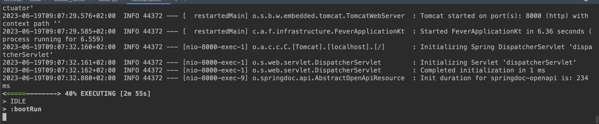
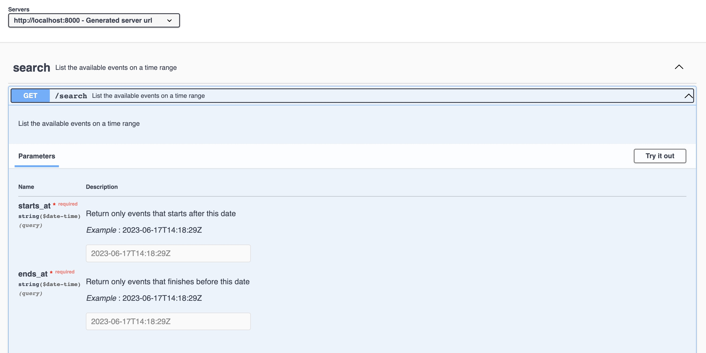
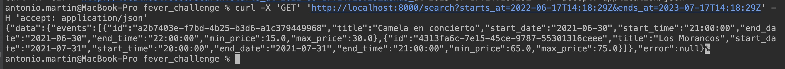
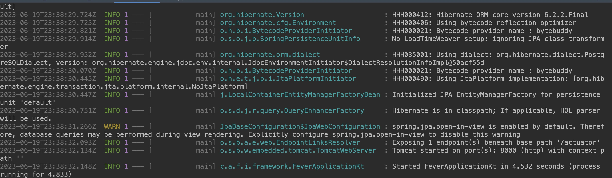
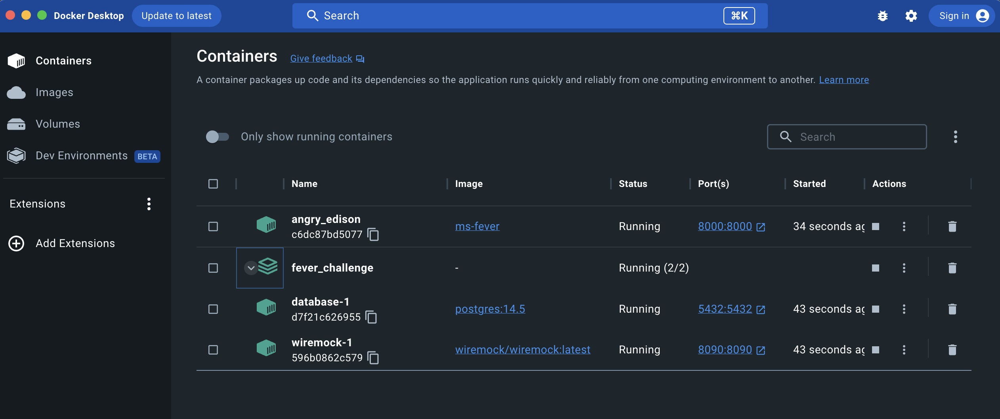
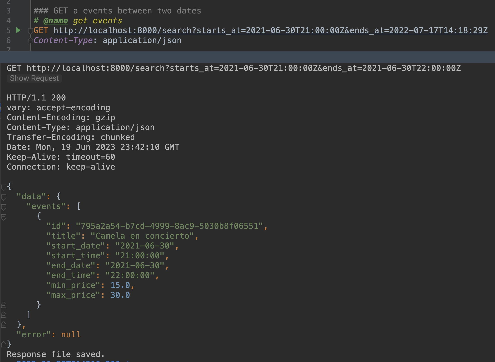
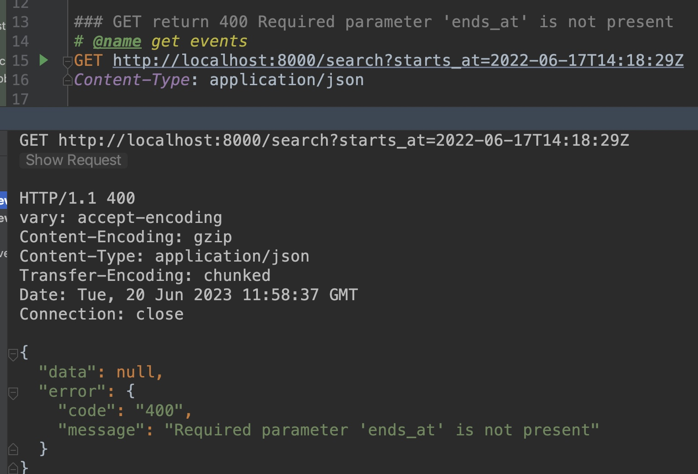
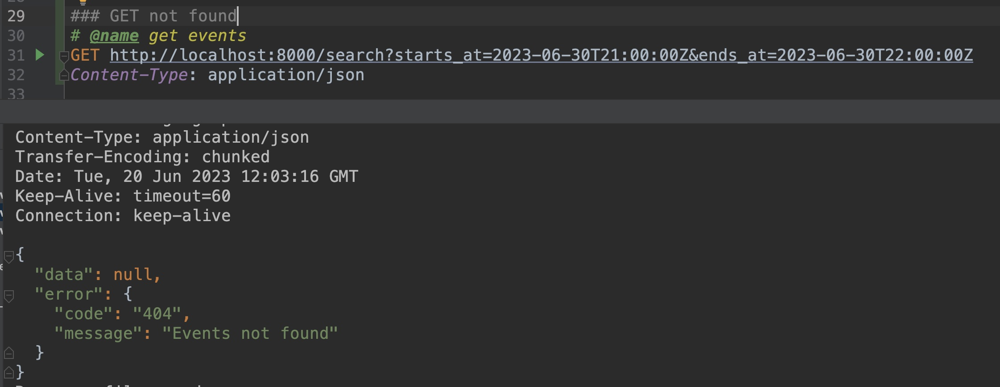
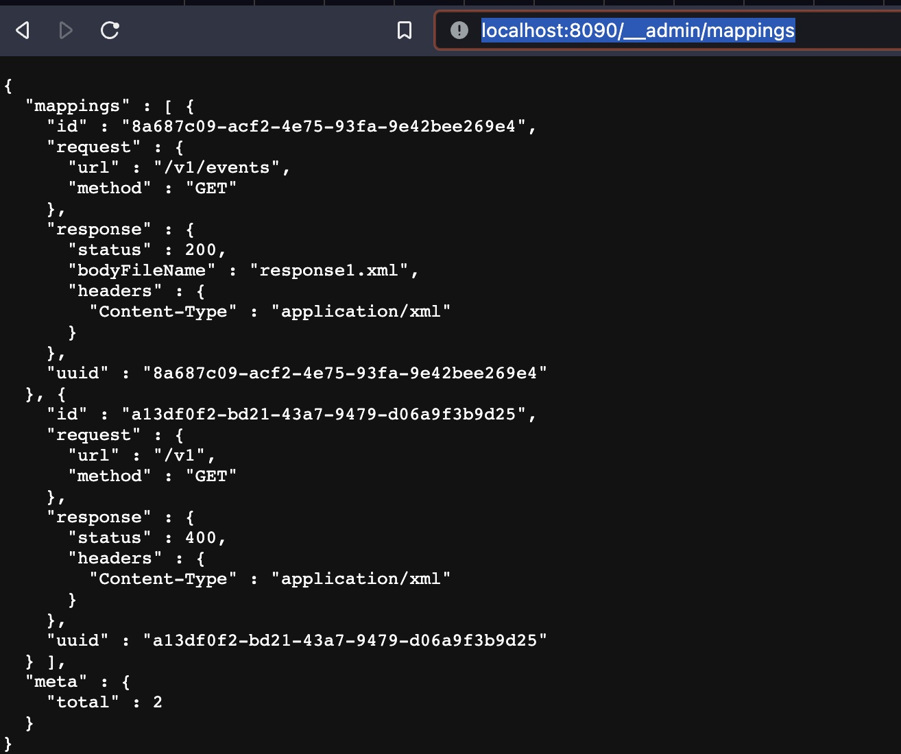

# Fever code challenge

## References

[Kotlin docs](https://kotlinlang.org/docs/home.html)

[Springboot-3 guide](https://docs.spring.io/spring-boot/docs/3.1.0-SNAPSHOT/reference/html/features.html#features.spring-application)

[Non-Blocking Spring Boot with Kotlin Coroutines](https://www.baeldung.com/kotlin/spring-boot-kotlin-coroutines)

[Going Reactive with Spring, Coroutines and Kotlin Flow](https://spring.io/blog/2019/04/12/going-reactive-with-spring-coroutines-and-kotlin-flow)

[Reactive or Coroutines: Between a rock and a hard place?](https://medium.com/digitalfrontiers/reactive-or-coroutines-between-a-rock-and-a-hard-place-6a41a151195a)

## Build & Run the app

build and execute the app
```bash
./gradlew clean build bootRun
```

stop the app
```bash
./gradlew -stop
```



as it's configured, gradle build the app, run all the tests and starts the app with the `docker-compose.yml` config behind.

### Friendly Reminder

Remember to clean the docker executions after and before to run the app in order 
to don't have any conflict with the port of the services

You can see the docker executions
```bash
docker ps -a -q
```

You can stop all the executions
```bash
docker rm -f $(docker ps -a -q)
```

Maybe you have the 8000 http port occupied. Check it: 

```bash
lsof -i:8000
```

and if the port if been used, you can kill the process if it's needed
```bash
sudo kill -9 pid
```

generate the gradlew command if you don't have it in the project.

```bash
gradle wrapper
```

## Swagger: endpoint documentation

The next step is checkout the exposed endpoints. 

To do that, click on the [swagger](http://localhost:8000/swagger-ui/index.html#/) link to visit the swagger documentation



## Testing endpoint via curl

```bash
curl -X 'GET' 'http://localhost:8000/search?starts_at=2021-06-17T14:18:29Z&ends_at=2023-07-17T14:18:29Z' -H 'accept: application/json'
```

or the same but with pretty print

```bash
curl -X 'GET' 'http://localhost:8000/search?starts_at=2021-06-17T14:18:29Z&ends_at=2023-07-17T14:18:29Z' -H 'accept: application/json' | json_pp  
```

You can find the `scr\test\resources\curl_testing.http` file to do the same using the intellij IDE.



## Docker image and docker-compose

If you want to deploy the application into a docker container you can use the 
the docker_build.sh script to create the fever app docker image.

```bash
sh ./docker_build.sh
```

After that you can run the docker-compose to rise the remaining infrastructure: wiremock (as events external provider) 
and the postgres database (to persistence). To do that, you can execute the next command: 

```bash
# hides the logs
docker-compose up -d
# or this, to see the logs
docker-compose up 
```

Once done, you can execute the next command to execute the app inside the docker network with the previous infrastructure running

```bash
sh ./docker_run.sh
```







Execute the endpoint or swagger to test the app (explained in the previous paragraph)

- Get events



- Bad request



- Not found events



### Another Docker-compose alternative

You can run rightly the `docker-compose-all.yml`, and you will have everything running.
The same as previously explained.

```bash
docker-compose -f docker-compose-all.yml up -d
````

### Wiremock and events external provider

I have used the wiremock server to emulate the external provider. 
So when you call to wiremock, it response you with an XML document with the events. 
It's a way to mock the external dependencies in a project.

- mappings http://localhost:8090/__admin/mappings



## Troubleshooting

Sometimes the app is not running well, or when we execute the `./gradlew clean build` command, the app can show errors 
in the tests.

Sometimes the problems can be related with the docker executions.

- Check the docker process and kill all of them: 

```bash
docker rm -f $(docker ps -a -q)
```

- check the opened ports: `8000, 8090 y 5432` of our servers, and kill all of them:

```bash 
# list the process consuming the resources for the next ports
lsof -i: 8000
lsof -i: 8090
lsof -i: 5432

# kill the process
sudo kill -9 pid
```

- stop the gradle executions:

```bash 
./gradlew -stop
```

- remove the docker fever image: 

```bash
docker rmi ms-fever
```

Once done, try to do `./gradlew clean build` and you can see if everything is alright

## Performance notes

You can deploy the app on kubernetes and measure the performance doing some stress test to know how many request can accept per second.
To do that you can use, jmeter to execute a burst of requests and see the response. Using datadog o graphana can help to
the graphics of the service, to see the health.

Deploying in two clusters of some instances of the microservices, with load balancers, increase the performance and the stability of the system.

In any case, to achieve the 5K request per second, we can set up kubernetes to ask as many service instances as we need to
consume all this traffic. It's no a scientist method, it's more about to tune the cluster.  
Kubernetes can adapt the number of instances of the microservice as we need depending on the traffic, adding stopping or adding new ones.
(`horizontal scaling`)

The infrastructure behind affects on the performance too. It depends on the AWS families in which microservices are running.
As better and expensive is the family, more request per second you will have: more IOPS and more data store space.

This applies too to the database, which can a bottleneck in your system if you don't tune it well.
If you size with not enough , after that, if the system needs more, you can increase it on demand (`vertical scaling`).

So sometimes to evaluate if a microservice performs or not performs for your needs, depends on how is
deployed in your infrastructure system.

### Zipkin: performance notes

Once you run the app, you can see the containers running:


Take a look on zipkin container, and open the next url:

http://127.0.0.1:9411/zipkin/

Here in this window you can check the request and the see the performance:


As much you use the service the latency is decreasing. 

`Outcomes`, the request back and forth takes over `40ms`, which is under the `200ms` as requirement on the assessment.

## Next Steps, evolving the app

I would like to add more features as

- [circuit breaker](https://spring.io/guides/gs/cloud-circuit-breaker/), to handle the load of the application in the case of communication errors or similar
- `cache`, as ideas to improve the system, I can image a local cache in to the microservice with 10 min TTL's or similar, 
and/or another piece of infrastructure to cache the requests to avoid call to the microservice with 10 min TTL's or similar,... 
- `moving to mono and flux reactive programming` to improve the performance
- `observability` (metrics and tracing) to see the behaviour of the app
- `CD/CI pipeline` to enable travis or github-actions, to run the continuous integration and the continuous deployment in a server.

  ...

### Final thoughts

I'm happy for being participated in this challenge.
I have learnt a lot, and I've enjoyed it so much.
Thank you for giving me the opportunity to do it.

:)